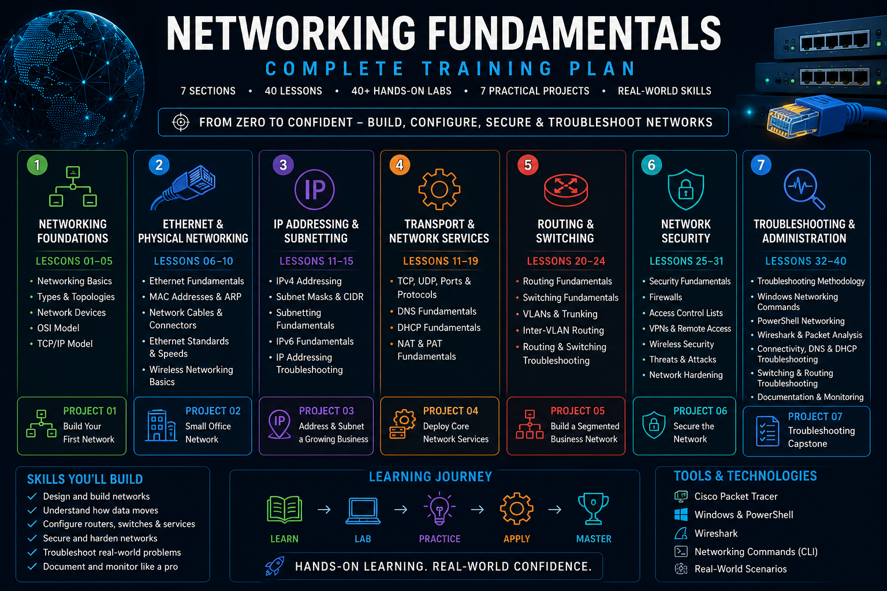

[🌐 Networking Fundamentals.md](https://github.com/user-attachments/files/31656768/Networking.Fundamentals.md)
# 🌐 Networking Fundamentals

A practical, hands-on guide to learning computer networking from the ground up.

Whether networking is completely new to you or you've already spent time troubleshooting devices, running `ipconfig`, configuring equipment, or working in IT, this course is designed to strengthen your understanding of **how networks actually work**.

You don't need to be a networking expert to begin. We'll start with the fundamentals, build each concept step by step, and gradually move into real-world configuration, troubleshooting, and network administration.

By the end, the goal isn't just to recognize networking terminology — it's to be able to **understand a network, investigate problems, and confidently use networking tools in real IT situations.**

---

<p align="center">
  
</p>

---

## 🎯 What You'll Learn

Throughout this course, you'll learn about:

- How computer networks work
- LANs, WANs, and other network types
- Network devices and their roles
- Network topologies
- The OSI and TCP/IP models
- Ethernet and MAC addressing
- IPv4 and IPv6 addressing
- Subnetting fundamentals
- DHCP and automatic addressing
- DNS and name resolution
- Routing and default gateways
- Switching
- TCP and UDP
- Common ports and protocols
- Wireless networking
- Network security fundamentals
- Firewalls and network segmentation
- VPNs and remote connectivity
- Network troubleshooting methodology
- Windows networking commands and tools
- Packet analysis
- Cisco Packet Tracer
- Building and troubleshooting networks

The course progresses from fundamental concepts into practical networking skills that can be applied in real IT environments.

---

# 🧭 How This Course Works

Networking is easier to learn when you can **see and use the concepts**, not just read about them.

For that reason, the course is divided into several parts.

## 📘 Lessons

Lessons explain the concepts and technologies you need to understand.

Each lesson focuses on a specific networking topic and prepares you for the corresponding lab.

---

## 🧪 Labs

Labs provide hands-on practice with the concepts introduced in each lesson.

Depending on the topic, you may use:

- Windows
- PowerShell
- Command Prompt
- Cisco Packet Tracer
- Wireshark
- Networking utilities
- Your own computer or network

The goal is to turn networking concepts into practical skills.

---

## 🛠️ Projects

Projects combine concepts from multiple lessons into larger real-world exercises.

Instead of following individual commands step by step, projects will challenge you to apply what you've learned to tasks such as:

- Building a small network
- Documenting a network
- Investigating connectivity problems
- Analyzing network traffic
- Configuring addressing
- Troubleshooting devices
- Performing a network assessment

Projects are designed to gradually require more independent problem-solving as you progress through the course.

---

# 🧑‍💻 Cisco Networking Academy Companion

This course can be used on its own, but it also works alongside Cisco's networking training.

Selected lessons will point to related material from **Cisco Networking Academy's Networking Basics course**.

Cisco resources can provide additional:

- Interactive learning
- Networking simulations
- Packet Tracer exercises
- Configuration practice
- Knowledge checks

You do **not** need to complete every Cisco activity before continuing through this course.

Think of Cisco Networking Academy as an additional practice environment that can reinforce what you're learning here.

➡️ [Cisco Networking Companion](resources/cisco-companion.md)

---

# 🖥️ Hands-On Networking

A major part of this course is learning how to investigate networks yourself.

You'll gradually become familiar with tools and commands such as:

```powershell id="v4f8km"
ipconfig
ping
tracert
nslookup
arp
netstat
route
Test-NetConnection
Get-NetIPConfiguration
Get-NetAdapter
Resolve-DnsName
```

You'll also learn **when and why** you would use each tool.

Later exercises will introduce network simulation and packet analysis so you can see what is happening behind the commands.

---

# 🧰 Tools Used

You won't need every tool immediately.

We'll introduce them as they become useful.

Some of the primary tools used throughout the course include:

- Cisco Packet Tracer
- Wireshark
- Windows PowerShell
- Windows Command Prompt
- Windows networking utilities
- Web browser
- GitHub

Installation instructions and useful links are available here:

➡️ [Getting Started](getting-started.md)

---

# 📂 Repository Structure

```text id="ssrbsi"
Networking-Fundamentals/
│
├── README.md
├── getting-started.md
│
├── lessons/
│   └── README.md
│
├── labs/
│   └── README.md
│
├── projects/
│   └── README.md
│
├── resources/
│   ├── README.md
│   └── cisco-companion.md
│
├── cheatsheets/
│   └── README.md
│
└── images/
    └── networking-fundamentals-training-plan.png
```

## 📘 `lessons/`

Contains the main networking lessons.

## 🧪 `labs/`

Contains hands-on exercises corresponding to the lessons.

## 🛠️ `projects/`

Contains larger exercises combining skills from multiple lessons.

## 📚 `resources/`

Contains additional learning resources, Cisco companion material, references, and useful links.

## 📋 `cheatsheets/`

Contains quick-reference material for commands, protocols, ports, addressing, troubleshooting, and other networking concepts.

## 🖼️ `images/`

Contains diagrams and images used throughout the training material.

---

# 🚀 Where to Start

If you're beginning the course for the first time, follow the course in this order.

### 1️⃣ Prepare Your Environment

➡️ [Getting Started](getting-started.md)

Install the tools we'll use and become familiar with the training environment.

### 2️⃣ Start the Lessons

➡️ [Networking Lessons](lessons/README.md)

Work through the lessons in order to build your networking knowledge.

### 3️⃣ Complete the Labs

➡️ [Networking Labs](labs/README.md)

Use the labs to practice what you learn in each lesson.

### 4️⃣ Test Your Skills

➡️ [Networking Projects](projects/README.md)

Projects combine multiple networking concepts into practical scenarios.

---

# 🧠 The Goal

You may begin this course knowing very little about networking.

You may also already work with networks regularly but want a stronger understanding of what is happening behind the scenes.

**Either starting point is fine.**

Networking knowledge develops by combining:

**Concepts → Observation → Practice → Troubleshooting**

The goal of this course is to help you move from:

> **"I know some networking commands."**

to:

> **"I understand what the network is doing, and I know how to start figuring out what's wrong."**

That ability is one of the most valuable skills you can develop in IT.

---

# 🌐 Ready to Begin?

Start by preparing your networking environment:

➡️ **[Getting Started](getting-started.md)**
